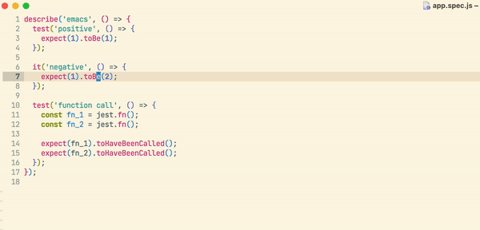
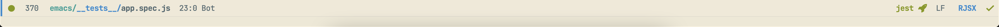
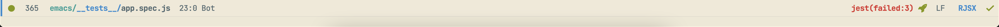
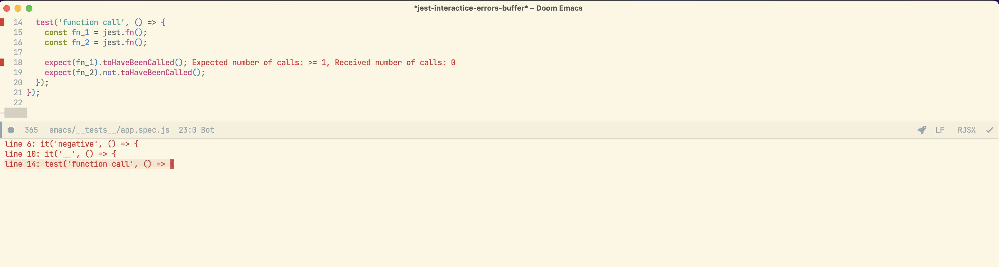

# jest-interactive-mode

emacs jest tool with immediately highlighting results

## Usage

### Commands

* `jest-interactive-mode`: Start jest in current file
* `jest-interactive-display-list-errors`: Show failed tests

## Screenshots

## Caveats

It's works for one test for now. When you finish with test file you should turn off mode and run for another. 
(fix it in the future)

## TODO
TBD
